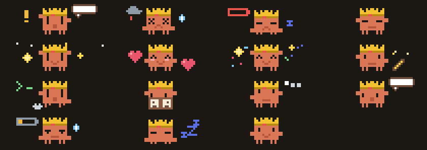

# Clawd



A pixel pet for [Claude Code](https://code.claude.com). Clawd lives above your prompt and shows what the agent is really doing: reading, editing, running a command, waiting for you, listening as you type, failing, finishing. When Claude launches subagents, each one joins him as a little Clawd in a flower meadow. He gets rounder as your context fills up, tires as you near the rate limit, and earns hats as you work.

> **Unofficial.** Clawd is a fan project. It is not affiliated with, endorsed by or supported by Anthropic. "Claude" and "Claude Code" are trademarks of Anthropic.

## Install

In Claude Code:

```
/plugin marketplace add kreddevils18/claude-clawd
/plugin install clawd@claude-clawd
```

Clawd shows up right away. Run `/clawd` to open the full-size pane.

**Needs** a Claude Code build with function hooks (mods). Tested with Claude Code 2.1.288. The mod API is early access and may change between releases; only [`hooks/register.tsx`](hooks/register.tsx) talks to it, so fixes stay small.

## What you see

**The band**: Clawd and what he is doing, above the prompt. The logo follows his state (arms, legs, eyes and size all change, and it animates while he works). It hides itself when the terminal is narrower than 60 columns.

```
▐▛███▜▌  Clawd · Lv 4 · Directing 3 agents…                      ▐▛███▜▌ ▐▛███▜▌ ▐▛███▜▌
▝▜█████▛▘ 3 agents working                                       ▝▜█████▛▘♥▝▜█████▛▘♥…
  ▘▘ ▝▝ ?                                                         ✿,❀ ▘▘"✾ ▝▝,❁"✿,❀"✾
```

**Subagents.** When Claude launches subagents, each one appears as a small Clawd on the right edge, standing in a field of colorful flowers and playing with the others (hearts drift between them). Each little Clawd shows what *that* subagent is doing (thinking, reading, editing, running a command, failing). When one finishes it celebrates for a few seconds, then leaves the meadow. The main Clawd, on the left, conducts with both arms and says "Directing N agents…".

**The pane** (`/clawd`): a 50×8-cell picture with props, speech bubbles, hats and particles. It is a true pixel raster in the terminal. On the desktop app and in the editor, where there is no raster element, the band and the pane are drawn as crisp vector art, with a painted meadow for the subagents.

**Known limit.** Claude Code raises no event when you answer a permission dialog, so "Waiting for you" stays up until the approved tool finishes.

### States

When several apply at once, the one nearest the top wins.

| State | When | Sound |
|---|---|---|
| wait | A permission prompt or question is open | pip |
| fail | A tool call just failed | |
| limit-hit | The 5-hour limit is at 100% | |
| burp | The context was just compacted | burp |
| level-up | Clawd just gained a level | |
| pat | You ran `/clawd pat` | |
| done | A turn just finished | |
| edit | Claude is editing or writing files | |
| bash | Claude is running a command | |
| read | Claude is reading, grepping or globbing | |
| think | The model is thinking, or using another tool (with subagents running: "Directing N agents…") |
| listening | You are typing in the prompt box | |
| limit-warn | The 5-hour limit is at 80% or more | |
| sleep | Idle for a minute | |
| idle | Anything else (blinks every 4 s) | |

Every state, every context size and every hat is in the [gallery](docs/gallery.html) (open the file in a browser).

**Context size.** Clawd is lean under 50% context, round with rosy cheeks up to 80%, and stuffed and sweating above that.

**Levels and hats.** Each finished turn earns 10 XP and each successful tool call 1 (30 at most per turn). Level = ⌊√(XP ÷ 25)⌋ + 1. Hats unlock at level 3 (beanie), 6 (crown) and 10 (wizard).

## Commands

| Command | Does |
|---|---|
| `/clawd` | Open the full pane |
| `/clawd pat` | Pat Clawd |
| `/clawd hat <beanie\|crown\|wizard\|auto\|none>` | Choose an unlocked hat (`auto` wears the best one) |
| `/clawd mute` · `/clawd unmute` | Sounds off or on (remembered) |
| `/clawd hide` · `/clawd show` | Hide or show the band (remembered) |
| `/clawd stats` | Level, XP to the next level, hats |

## Privacy

Clawd runs entirely on your machine. It has **no runtime dependencies**, makes **no network requests**, makes **no model calls**, starts **no processes of its own** (the two sounds play through Claude Code's own audio player), and writes nothing except its own small profile (XP, level, hat, two switches) in Claude Code's per-plugin store. Everything it knows comes from events Claude Code already raises. It notices *that* you are typing, never *what* you type. The adapter lists the only calls it makes; `claude plugin validate .claude-plugin/plugin.json` prints them.

## Contributing

New states are the most welcome contribution, and adding one touches only one new file and one registry line. Start with [CONTRIBUTING.md](CONTRIBUTING.md); how the pieces fit is in [docs/architecture.md](docs/architecture.md).

## Credits

The sounds are synthesized with ffmpeg and released under CC0 (see [sounds/README.md](sounds/README.md)). The code is [MIT](LICENSE).
